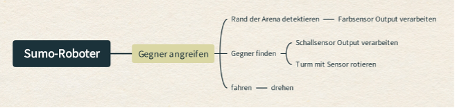
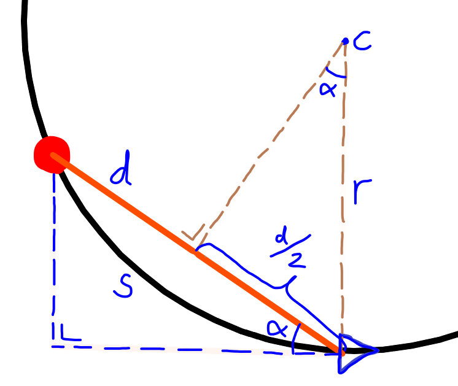
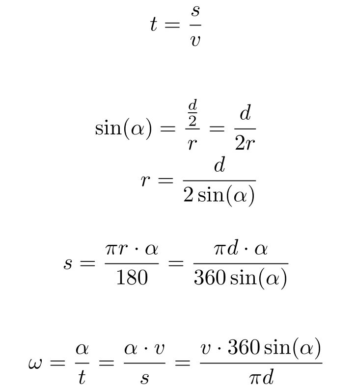

# Robotik Wettbewerb 2023

Gabriel Luis und Jodok haben sich entschieden, am Robolympics-Wettbewerb 2023 im Rahmen des Ergänzungsfachs teilzunehmen. Unser Ziel ist es, einen Mini-Sumo-Kampfroboter zu bauen, der auf der LEGO Mindstorms-Plattform basiert.

## Organisation und Prozess
Bei unserer Aufgabe des Mini-Sumo-Kämpfers ist das Ziel, einen Roboter zu bauen, der, wie beim klassischen Sumo-Ring, einen Gegner aus einem 115 cm Durchmesser Ring drücken soll. Der erste, der aus der schwarzen Fläche mit weissem Rand, welcher dem Roboter anhand eines Lichtsensors ermöglicht den Rand zu erkennen, gestossen wurde, hat verloren. Falls nach 90s niemand verloren hat, ist die Runde auch vorbei. Der Roboter muss selbstständig nach dieser Zeit aufhören, jegliche Bewegung zu machen, ansonsten ist man ebenfalls disqualifiziert. Klar ist, dass man als Zuschauer nicht in die Partie eingreifen darf, ansonsten wird man direkt disqualifiziert. Die Teilnehmer starten ihre Roboter per Tastendruck und entfernen sich. Beide Roboter müssen danach mindestens 5 Sekunden warten, bevor sie sich fortbewegen dürfen. Der Roboter darf auf keinen Fall ferngesteuert werden. Das Ziel ist es also den Gegner zu "sehen" oder einfach nach einem Zufallsmuster den anderen versuchen wegzuschieben.

Formalitäten des Roboters, die gegeben sind:
- Einen maximalen Umfang von 65 cm vor dem Start nicht überschreiten.
- Die Höhe ist nicht limitiert.
- Das zulässige Maximalgewicht beträgt 775 g.

## Umsetzung Prototyp und Entwurf
Die Wahl fiel auf eine maximale Strassenhaftung, um sicherzustellen, dass der Roboter nicht ins Rutschen gerät, wenn er andere Sumo-Ringer angreift. Dies wurde durch den Einsatz von Doppelrädern erreicht, die die grösste Fläche aller LEGO Mindstorms-Räder bieten. Die Seiten des Roboters wurden mit möglichst glatten LEGO-Teilen ausgestattet, um zu verhindern, dass er leicht vom Gegner weggeschoben wird.

Nach dieser Idee haben wir am ersten Workshop-Wochenende begonnen zu bauen. Luis und Jodok haben sich um den Bau und deren Entwicklungsideen gewidmet. Luis hat viel Erfahrung mit LEGO Technics, und wir hatten viele Ideen, wie wir diesen Ansatz von grossem Gewicht mit hoher Kraftübertragung auf den Boden umsetzen können.

Das Design des Roboters sieht wie folgt aus: Zwei Motoren, jeweils mit zwei Rädern, sind in der Mitte positioniert, was einen guten Wendekreis ermöglicht. Für das Programmieren kann man im Programm festlegen, dass die Wände zudem so tief am Boden platziert sind wie möglich, um zu verhindern, dass der Roboter von anderen Robotern mit einer Art Gabel angehoben wird.

Der Roboter besitzt zwei Farbsensoren an den Seiten vorne, die sicherstellen, dass er nicht aus der Arena herausfährt, und einen Schallsensor oben, der rotiert und nach dem Gegner sucht, um ihn danach anzugreifen. Unsere erste Idee war es, den Ultraschallsensor auch während des Fahrens nach Gegnern suchen zu lassen und sobald er einen Gegenstand (Gegner) an einem Ort sieht, auf den zufährt und weiterhin in dieser Zone zu suchen, um einen Art Verfolgungsalgorithmus zu haben. Dies zeigte sich als zu grossen Aufwand im Vergleich zum Vorteil, welcher erreicht worden wäre, wie es auch im Nachhinein nach dem Wettbewerb ausgekommen ist.


## Wettkampfversion

Am Samstag, den 18. November, trafen sich in Rapperswil alle Gruppen aus der gesamten Schweiz, um an den Robolympics teilzunehmen. Auch unser Gymnasium wurde durch 4 Gruppen vertreten. Noch am Tag zuvor, am Freitag im EF Informatik, mussten wir an unserer Version arbeiten, da sie die Vorgabe von 775 Gramm nicht einhielt. Wir hätten nie gedacht, dass wir zu schwer sein würden. Auf jeden Fall musste am Design noch gearbeitet werden, um 80 Gramm leichter zu werden. Dies wurde erreicht, aber auf Kosten der Stabilität unseres Roboters und dem Entfernen der Doppelräder.

Am Tag des Wettbewerbs stellte sich heraus, dass unser Sumo-Kämpfer einen zu grossen Umfang hatte. Den Umfang mussten wir dann vor Ort verkleinern. Dies gelang unserer Gruppe, indem wir die Kabel besser verpackten und die Sensoren besser platzierten. Nach all diesen Änderungen war unser Roboter nicht mehr ganz so, wie wir es uns vorgestellt hatten.

Es ist uns aufgefallen, dass eine grosse Schwäche unseres Roboters ist, dass er beim Scannen des Gegners still steht, da er sich in diesem Zustand falls er angegriffen wird nicht wehrt. Am Anfang haben wir versucht, dieses Problem zu lösen, indem wir den Roboter, während dem Fahren scannen lassen. Die Umsetzung hat aber nicht funktioniert und wir hatten nicht genug Zeit, um das bis zum Wettkampf zu implementieren.

Hier ein Video von der ersten Runde des Achtelfinals unseres Teams: [Achtelfinal Sumo Team GBSL](https://youtube.com/shorts/wJk6DLAsICE?si=EJWIg6loNUbEMU2z/)

## Programmierung

Unser Top-Down entwurf des programms sieht wie folgt aus:



Als Erstes werden alle Objekte zur Steuerung des Roboters definiert

```python
ev3 = EV3Brick()
motor_left = Motor(Port.A)
motor_right = Motor(Port.B)
ultra_motor = Motor(Port.C, Direction.COUNTERCLOCKWISE) # Motor für die Rotation des Ultraschallsensors

ultra_sensor = UltrasonicSensor(Port.S1)
cs_right = ColorSensor(Port.S2)
cs_left = ColorSensor(Port.S3)

robot = DriveBase(motor_left, motor_right, 56, 87)
robot.settings(300, 1000)

watch = StopWatch() # Stoppuhr für die Messung der Zeit
```

Als nächstes werden alle Zustände definiert, die dazu dienen eine Zustandsmaschine aufzustellen

```python
RAND_LINKS = 11
RAND_RECHTS = 12
FAHREN = 2
SCANNEN_RECHTS = 31
SCANNEN_LINKS = 32
NICHTS = 4
```
Dann definiert man ein paar Variablen, die im Programm wichtig sind, als Konstanten, Parameter zur Steuerung des Roboters, usw. Alle sind mit ihrer Funktion unten kommentiert

```python
not_angle = 120  # Drehwinkel nach dem Erreichen des Randes
reflection_limit = 30  # Anteil des reflektierten Lichtes, zur Bestimmung ob der Rand erreicht wird

maxa_target = 90  # Maximaler Auslenkungswinkel des Ultraschallsensors
mina_target = -90  # Minimaler Auslenkungswinkel des Ultraschallsensors
us_speed = 90  # Die Winkelgeschwindigkeit des Ultraschallsensors
us_distances = {}  # Dictionary, zu jedem Winkel wird später ein Wert für die Distanz zugeteilt

drive_speed = 300  # Geschwindigkeit des Roboters in mm/s
turn_speed = 0  # Drehgeschwindigkeit des Roboters in °/s
```

Der initiale Zustand wird als `SCANNEN_RECHTS` definiert, da der Roboter damit beginnen soll, zu scannen, ob der andere Roboter rechts ist. Ausserdem wird die Zeit hier angefangen zu messen.

```python
# Als Erstes soll der Roboter nach rechts nach einem anderen Roboter scannen
zustand = SCANNEN_RECHTS
watch.reset()   # Hier beginnen die Zeit zu messen

```

In der Funktion `reflection_detection()` prüft man, ob der Roboter den Rand erreicht hat, dies besteht aus if-Statements. Im ersten if-Statement bestimmt man, ob die Menge reflektiertes Licht im linken Farbsensor das global gesetze Reflektionslimit übersteigt. Wenn das der Fall ist, gibt man den Zustand `RAND_LINKS` zurück. Sonst gilt das gleiche mit dem rechten Farbsensor. Und falls bestimmt wurde, dass der Roboter den Rand nicht erreicht hat wird None zurückgegeben. 

```python
def reflection_detection():
    """
    Prüft, ob der Roboter sich am Rand des Rings befindet
    Returns
    --------
    int or None
        Der neue Zustand, falls der Roboter sich am Rand befindet, sonst None
    """
    
    if cs_left.reflection() > reflection_limit: # Reflektion des rechten Farbsensors grösser als das Limit
        zustand = RAND_LINKS
    elif cs_right.reflection() > reflection_limit:  # Reflektion des linken Farbsensors grösser als das Limit
        zustand = RAND_RECHTS
    else:   # Beide Farbsensoren haben keine grosse Reflektio gefunden
        zustand = None
    return zustand
```

Die Funktion `check_end()` definiert ein kontrolliertes Exit. Falls der Roboter schon 90 Sekunden läuft oder die linke Taste des Roboters gedrückt wird, werden alle Motoren gestoppt und der Zustand zu `NICHTS` geändert. 

```python
def check_end():
    """
    Testet, ob das Programm verlassen werden soll
    Returns
    -------
    int or None
        `NICHTS`falls das Programm verlassen wird, sonst None
    """
    
    # Wenn 90 Sekunden verstrichen sind oder die linke Taste des Roboters gedrückt wurde, wird das Programm verlassen
    if watch.time() > 90000 or Button.LEFT in ev3.buttons.pressed():
        ultra_motor.hold()  # Ultraschallsensor stoppen
        robot.stop()    # Roboter stoppen
        return NICHTS
    
    return None
```

Für die Praktibilität haben wir eingebaut, dass das Programm startet, sobald die rechte Taste des Roboters gedrückt wird. 

```python
# Zum Starten des Programms muss die rechte Taste des Roboters gedrückt werden
while not Button.RIGHT in ev3.buttons.pressed():
    pass

# Die Zeit wird hier angefangen zu zählen
watch.reset()
```

Die ganzen Zustandsmaschine definiert man in einer while-Schleife, da sie non-stop laufen soll. 
In der Zustandsmaschine prüft man als Erstes, ob das Ende des Programms erreicht ist, und damit der Zustand geändert werden soll. 

Ein Zustand, in welchem der Roboter sein kann ist `FAHREN`. Während dem Fahren soll der Ultraschallsensor nicht in einem Winkel ausgerichtet sein, sondern bei 0°. Natürlich soll er auch fahren. Bei jedem Durchgang prüft man ausserdem, ob einer der Farbsensoren den Rand detektieren. 
Bei einem `or`-Statement wird das Element, welches nicht null ist zurückgegeben. Wenn beide nicht null sind, wird das erste zurückgegeben. Dadurch wird im Abschnitt `zustand = check_end() or zustand`, `zustand` zurückgegeben, falls die Returnvalue der Funktion null ist. 
 

```python
# Zustandsmaschine
while True:
    zustand = check_end() or zustand    # Zustand soll verändert werden falls das Programm verlassen werden soll

    # Der übliche Fahrzustand
    if zustand == FAHREN:
        ultra_motor.run_target(us_speed, 0, wait=False) # Ultraschallsensor wird auf die initiale Rotation gebracht
        robot.drive(drive_speed, turn_speed)    # Roboter fährt mit gewisser Geschwindigkeit

        zustand = reflection_detection() or zustand # Zustand ändert sich, falls der Roboter am Rand ist
```

Ein weiterer Zustand, `RAND_LINKS` definiert, wie der Roboter sich verhalten soll, falls auf der linken Seite Rand detektiert wird. Dann soll der Roboter um einen Winkel in Uhrzeigersinn drehen, und wieder nach dem Gegner scannen.

```python 
# Roboter ist auf der linken Seite am Rand
elif zustand == RAND_LINKS:
	robot.turn(not_angle)   # Roboter soll sich um einen Winkel in Uhrzeigersinn drehen
	zustand = SCANNEN_RECHTS    # Zustand wechseln, um nach Gegnern zu scannen
	us_distances.clear()
```

Falls der Roboter auf der rechten Seite Rand detektiert, soll er sich gleich verhalten wie wenn er Rand auf der linken Seite detektiert mit der Ausnahme, dass er sich in Gegeruhrzeigersinn dreht. 

```python
# Roboter ist auf der rechten Seite am Rand
elif zustand == RAND_RECHTS:
	robot.turn(-not_angle)  # Roboter soll sich um einen Winkel in Gegenuhrzeigersinn drehen
	zustand = SCANNEN_RECHTS    # Zustand wechseln, um nach Gegnern zu scannen
	us_distances.clear()
```

Um nach einem Gegner zu suchen, muss der Roboter im Zustand `SCANNEN_RECHTS` sein. Bei jedem Durchgang wird der Ultraschallsensor in Uhrzeigersinn rotiert, um dann beim aktuellen Winkel die Distanz zu messen. Der aktuelle Winkel und die gemessene Distanz werden in einem Dictionary als Key-Value Pair verbunden. Damit der sensor nicht einen Winkel von 90° überschreitet, wechselt man den Zustand des Roboters zu `SCANNEN_LINKS`.
Für einen Fall, indem ein Gegner den Roboter an den Rand schiebt, wird auch während dem Scannen die Funktion `reflection_detection()` aufgerufen. 

Um sicher zu sein, dass im Dictionary nicht Werte von vorherigen Scans existieren, wird bei jedem Zustandswechsel zu `SCANNEN_RECHTS` der Inhalt des Dictionarys gelöscht. 

```python
# Roboter scannt nach rechts für Gegner
elif zustand == SCANNEN_RECHTS:
	ultra_motor.run(us_speed)   # Ultraschallsensormotor drehen lassen in Uhrzeigersinn
	us_distances[ultra_motor.angle()] = ultra_sensor.distance() # Den derzeitigen Richtungswinkel des Ultraschallsensors mit der gemessenen Distanz verbinden

	# Falls der Ultraschallsensor einen Winkel von 90° hat, in andere Richtung scannen
	if ultra_motor.angle() >= 90:
		zustand = SCANNEN_LINKS

	zustand = reflection_detection() or zustand # Zustand ändert sich, falls der Roboter am Rand ist
```

Das Scannen nach links ist das gleich aufgebaut wie das Scannen nach rechts mit zwei Ausnahmen. Als Erstes dreht man den Ultraschallsensor in Gegenuhrzeigersinn. Als Zweites wird beim Überschreiten des Winkels von -90° die Winkelgeschwindigkeit des Roboters wie folgt ausgerechnet:
Als Erstes muss man entdecken wo sich der Gegner befindet, dafür findet man bei welchem Winkel die kleinste Distanz gemessen wurde. Falls diese Distanz 0 ist, wird die Winkelgeschwindigkeit als 0 angenommen, da entweder ein Fehler unterlaufen ist oder der Gegner sehr nah am Roboter ist. Sonst wird mit einer Formel die Winkelgeschwindigkeit herausgefunden. 
Im Bild darunter ist in blau der Roboter und in rot der Gegner.




Wie oben dargestellt wird die Formel hergeleitet. Für die Herleitung hatten wir ein paar Probleme, sodass beim Wettkampf eine andere verwendet wurde, die als Nachteil hatte, dass der Roboter manchmal mit dem richtigen Winkel in die falsche Richtung fuhr. Nach dem Wettkampf schauten wir uns das Problem noch ein Mal an, und fanden die richtige Formel. 

Zurück zum Programm, falls der Match seit mehr als 5 Sekunden angefangen hat, wechselt der Roboter den Zustand zu `FAHREN`, wo dann die Winkelgeschwindigkeit gebraucht wird. 

```python
# Roboter scannt nach links für Gegner
elif zustand == SCANNEN_LINKS:
	ultra_motor.run(-us_speed)  # Ultraschallsensormotor drehen lassen in Gegenuhrzeigersinn
	us_distances[ultra_motor.angle()] = ultra_sensor.distance() # Den derzeitigen Richtungswinkel des Ultraschallsensors mit der gemessenen Distanz verbinden

	if ultra_motor.angle() <= -90:
		angle = min(us_distances, key=us_distances.get) # Winkel, bei der die kleinste Entfernung gemessen wurde
		ultra_motor.stop()  # Motor des Ultraschallsensors stoppen

		# Wenn der Gegner gerade vor uns ist, muss man nicht die Winkelgeschwindigkeit berechnen, sonder gerade auf 0 setzen. 
		if us_distances[angle] == 0:
			turn_speed = 0
		else:
			turn_speed = drive_speed * 360 * math.sin(angle) / (math.pi * us_distances[angle]) # Die Winkelgeschwindigkeit berechnen

		while not watch.time() > 5000:  # Nur fahren wenn schon 5 Sekunden verstrichen sind
			pass    
		zustand = FAHREN
	zustand = reflection_detection() or zustand # Zustand ändert sich, falls der Roboter am Rand ist
```

Der letzte definierte Zustand ist `NICHTS`, das ist ein verbessertes Verlassen des Programms. Darin wird der Ultraschallsensor auf seine initiale Rotation gebracht, damit muss man nicht mehr den Ultraschallsensor manuell wieder rotieren. 

```python
# Das Programm verlassen
elif zustand == NICHTS:
	ultra_motor.run_target(us_speed, 0) # Ultraschallsensor wird auf die initiale Rotation gebracht
	break   # Unendliche while-Schleife mit einem `break` verlassen
```

## Rückblick / Erfahrungen

### Roboterbau und Programmierung
Es ist uns aufgefallen, dass eine große Schwäche unseres Roboters besteht darin, dass er beim Scannen des Gegners stillsteht. In diesem Zustand wehrt er sich nicht, wenn er angegriffen wird. Anfangs versuchten wir, dieses Problem zu lösen, indem wir den Roboter während der Fahrt scannen ließen. Die Umsetzung funktionierte jedoch nicht, und uns fehlte die Zeit, dies bis zum Wettkampf zu implementieren.

### Wettkampf

Als Gruppe waren wir anfangs skeptisch, ob wir überhaupt eine Chance haben, da unser Roboter mechanisch gesehen einen großen Nachteil gegenüber den anderen Gruppen hatte. Allerdings konnten wir den Vorteil nutzen, den Gegner zu orten und nicht ziellos in eine Richtung zu fahren, wie es die meisten Gruppen taten. Dank unserem Turm mit Ultraschallsensor konnten wir den Gegner lokalisieren und direkt auf ihn zufahren. Mit diesem Vorteil und etwas Glück in einem Kampf haben wir es auf den 4. Platz geschafft.

### Vorgehensweise und Projekt insgesamt

Insgesamt haben wir das Projekt mit einer guten Arbeitsverteilung bewältigt. Es gibt jedoch Verbesserungsmöglichkeiten in der Zeiteinteilung. Wir hätten die formellen Bedingungen früher überprüfen und mehr Zeit für das Programmieren einplanen sollen. Unser Roboter hat in einigen Läufen den Gegner nicht erkannt.
