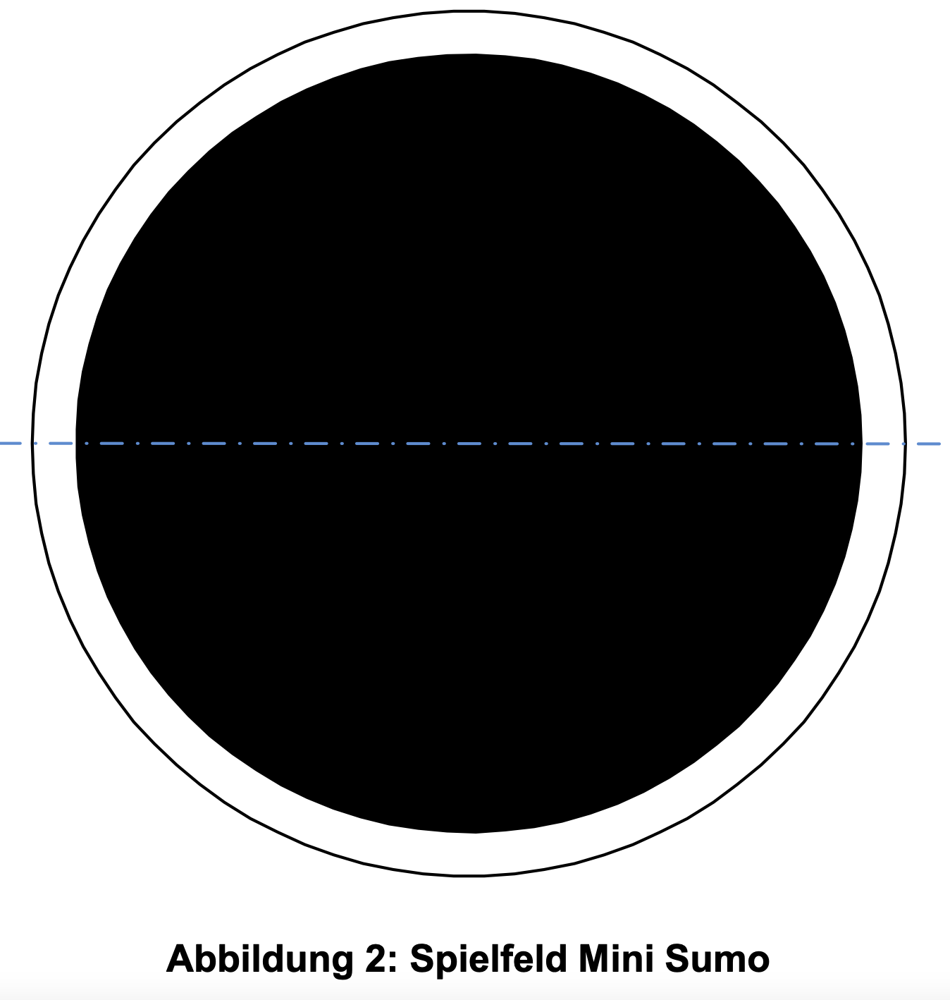

# Robotik Wettbewerb 2023

Gabriel Luis und Jodok haben sich entschieden, am Robolympics-Wettbewerb 2023 im Rahmen des Ergänzungsfachs teilzunehmen. Unser Ziel ist es, einen Mini-Sumo-Kampfroboter zu bauen, der auf der LEGO Mindstorms-Plattform basiert.

## Organisation und Prozess
Bei unserer Aufgabe des Mini-Sumo-Kämpfers ist das Ziel, einen Roboter zu bauen, der, wie beim klassischen Sumo-Ring, einen Gegner aus einem 115 cm Durchmesser Ring drücken soll. Der erste, der aus der schwarzen Fläche (siehe Bild) gestoßen wurde, hat verloren. Oder nach 90 Sekunden ohne dass jemand gewinnt, ist die Runde auch vorbei. Klar ist, dass man als Zuschauer nicht in die Partie eingreifen kann und darf, ansonsten wird man direkt disqualifiziert. Jede Runde wird vom Schiedsrichter gestartet. Die Teilnehmer starten ihre Roboter per Tastendruck und entfernen sich. Beide Roboter müssen danach mindestens 5 Sekunden warten, bevor sie mit irgendeiner Aktion beginnen.

Formalitäten des Roboters, die gegeben sind:
- Einen maximalen Umfang von 65 cm vor dem Start nicht überschreiten.
- Die Höhe ist nicht limitiert.
- Das zulässige Maximalgewicht beträgt 775 g.

## Umsetzung
Die Wahl fiel auf eine maximale Strassenhaftung, um sicherzustellen, dass der Roboter nicht ins Rutschen gerät, wenn er andere Sumo-Ringer angreift. Dies wurde durch den Einsatz von Doppelrädern erreicht, die die größte Fläche aller LEGO Mindstorms-Räder bieten. Die Seiten des Roboters wurden mit möglichst glatten LEGO-Teilen ausgestattet, um zu verhindern, dass er leicht vom Gegner weggeschoben wird. NAch dieser idee haben wir am ersten workshop wochenende begonnen zu bauen. Luis und Jodok haben sich um den bau und deren entwicklungsideen gewidmet. Luis hat viel erfahrung mit lego technics und wir hatten durch das viele ideen wie wir diesen ansatz von grossem gewicht mit einer hohen krat übertragung auf den boden.Das Design des Roboters sieht wie folgt aus: Zwei Motoren, jeweils mit zwei Rädern, sind in der Mitte positioniert, was einen guten Wendekreis ermöglicht. Für das programmieren kann man im programm festlegen  Die Wände sind zudem so tief am Boden platziert wie möglich, um zu verhindern, dass der Roboter von anderen Robotern mit einer Art Gabel angehoben wird. Der Roboter besitzt zwei Farbsensoren an den Seiten vorne, welche sicher stellen, dass er nicht aus der Arena herausfahrt und einen Schallsensor oben, welcher rotiert und nach dem Gegener sucht, um ihn danach azugreifen.

## Programmierung

