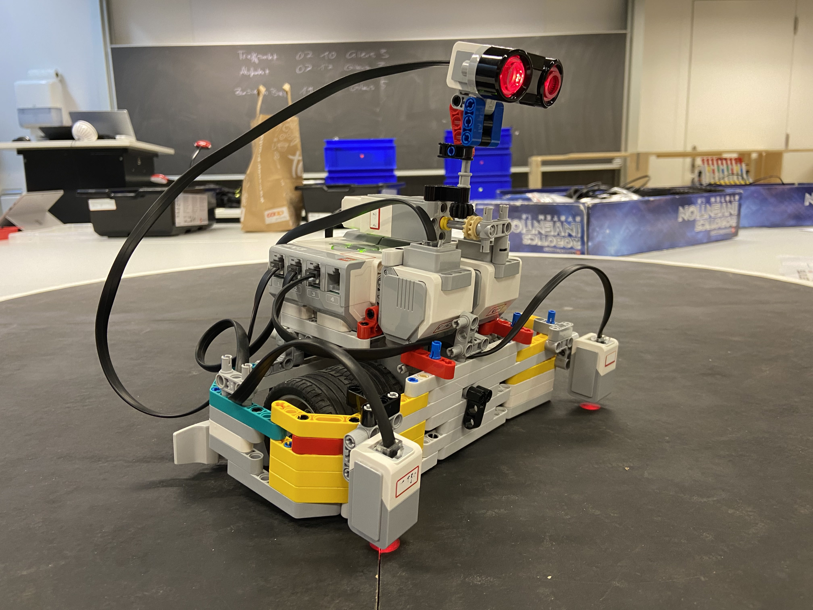

# Robotik Wettbewerb 2023

Gabriel Luis und Jodok haben sich entschieden, am Robolympics-Wettbewerb 2023 im Rahmen des Ergänzungsfachs teilzunehmen. Unser Ziel ist es, einen Mini-Sumo-Kampfroboter zu bauen, der auf der LEGO Mindstorms-Plattform basiert.

## Organisation und Prozess
Bei unserer Aufgabe des Mini-Sumo-Kämpfers ist das Ziel, einen Roboter zu bauen, der, wie beim klassischen Sumo-Ring, einen Gegner aus einem 115 cm Durchmesser Ring drücken soll. Der erste, der aus der schwarzen Fläche mit weissem Rand, welcher dem Roboter anhand eines Lichtsensors ermöglicht den Rand zu erkennen, gestossen wurde, hat verloren. Oder nach 90 Sekunden ohne dass jemand gewinnt, ist die Runde auch vorbei. Klar ist, dass man als Zuschauer nicht in die Partie eingreifen kann und darf, ansonsten wird man direkt disqualifiziert. Jede Runde wird vom Schiedsrichter gestartet und dauert maximal 90 Sekunden. Der Roboter muss selbstständig nach dieser Zeit aufhören, jegliche Bewegung zu machen, ansonsten ist man ebenfalls disqualifiziert. Die Teilnehmer starten ihre Roboter per Tastendruck und entfernen sich. Beide Roboter müssen danach mindestens 5 Sekunden warten, bevor sie mit irgendeiner Aktion beginnen. Der Roboter darf auf keinen Fall ferngesteuert werden. Das Ziel ist es also wirklich den anderen entweder zu "sehen" oder einfach nach einem Zufallsmuster den anderen versuchen wegzuschieben.

Formalitäten des Roboters, die gegeben sind:
- Einen maximalen Umfang von 65 cm vor dem Start nicht überschreiten.
- Die Höhe ist nicht limitiert.
- Das zulässige Maximalgewicht beträgt 775 g.

## Umsetzung Prototyp
Die Wahl fiel auf eine maximale Strassenhaftung, um sicherzustellen, dass der Roboter nicht ins Rutschen gerät, wenn er andere Sumo-Ringer angreift. Dies wurde durch den Einsatz von Doppelrädern erreicht, die die grösste Fläche aller LEGO Mindstorms-Räder bieten. Die Seiten des Roboters wurden mit möglichst glatten LEGO-Teilen ausgestattet, um zu verhindern, dass er leicht vom Gegner weggeschoben wird.

Nach dieser Idee haben wir am ersten Workshop-Wochenende begonnen zu bauen. Luis und Jodok haben sich um den Bau und deren Entwicklungsideen gewidmet. Luis hat viel Erfahrung mit LEGO Technics, und wir hatten viele Ideen, wie wir diesen Ansatz von grossem Gewicht mit hoher Kraftübertragung auf den Boden umsetzen können.

Das Design des Roboters sieht wie folgt aus: Zwei Motoren, jeweils mit zwei Rädern, sind in der Mitte positioniert, was einen guten Wendekreis ermöglicht. Für das Programmieren kann man im Programm festlegen, dass die Wände zudem so tief am Boden platziert sind wie möglich, um zu verhindern, dass der Roboter von anderen Robotern mit einer Art Gabel angehoben wird.

Der Roboter besitzt zwei Farbsensoren an den Seiten vorne, die sicherstellen, dass er nicht aus der Arena herausfährt, und einen Schallsensor oben, der rotiert und nach dem Gegner sucht, um ihn danach anzugreifen. Unsere erste Idee war es, den Ultraschallsensor auch während des Fahrens nach Gegnern suchen zu lassen und sobald er einen Gegenstand (Gegner) an einem Ort sieht, auf den zufährt und weiterhin in dieser Zone zu suchen, um einen Art Verfolgungsalgorithmus zu haben. Dies zeigte sich als zu grossen Aufwand im Vergleich zum Vorteil, welcher erreicht worden wäre, wie es auch im Nachhinein nach dem Wettbewerb ausgekommen ist.




## Programmierung
Als Erstes werden alle Objekte zur Steuerung des Roboters definiert

```python
ev3 = EV3Brick()
motor_left = Motor(Port.A)
motor_right = Motor(Port.B)
ultra_motor = Motor(Port.C, Direction.COUNTERCLOCKWISE)

ultra_sensor = UltrasonicSensor(Port.S1)
cs_right = ColorSensor(Port.S2)
cs_left = ColorSensor(Port.S3)

robot = DriveBase(motor_left, motor_right, 56, 87)
robot.settings(300, 1000)

watch = StopWatch()
```

Als nächstes werden alle Zustände definiert, die dazu dienen eine Zustandsmaschine aufzustellen

```python
RAND_LINKS = 11
RAND_RECHTS = 12
FAHREN = 2
SCANNEN_RECHTS = 31
SCANNEN_LINKS = 32
NICHTS = 4
```
Dann definiert man ein paar Variablen, die im Programm wichtig sind, als Konstanten, Parameter zur Steuerung des Roboters, usw. Alle sind mit ihrer Funktion unten kommentiert

```python
not_angle = 120  # Drehwinkel nach dem Erreichen des Randes
reflection_limit = 30  # Anteil des reflektierten Lichtes, zur Bestimmung ob der Rand erreicht wird

maxa_target = 90  # Maximaler Auslenkungswinkel des Ultraschallsensors
mina_target = -90  # Minimaler Auslenkungswinkel des Ultraschallsensors
us_speed = 90  # Die Winkelgeschwindigkeit des Ultraschallsensors
us_distances = {}  # Dictionary, zu jedem Winkel wird später ein Wert für die Distanz zugeteilt

drive_speed = 300  # Geschwindigkeit des Roboters in mm/s
turn_speed = 0  # Drehgeschwindigkeit des Roboters in °/s
```

Der initiale Zustand wird als `SCANNEN_RECHTS` definiert, da der Roboter damit beginnen soll, zu scannen, ob der andere Roboter rechts ist. Ausserdem wird die Zeit hier angefangen zu messen.

```python
zustand = SCANNEN_RECHTS
watch.reset()
```

In der Funktion `reflection_detection()` prüft man, ob der Roboter den Rand erreicht hat, dies besteht aus if-Statements. Im ersten if-Statement bestimmt man, ob die Menge reflektiertes Licht im linken Farbsensor das global gesetze Reflektionslimit übersteigt. Wenn das der Fall ist, gibt man den Zustand `RAND_LINKS` zurück. Sonst gilt das gleiche mit dem rechten Farbsensor. Und falls bestimmt wurde, dass der Roboter den Rand nicht erreicht hat wird None zurückgegeben. 

```python
def reflection_detection():
    if cs_left.reflection() > reflection_limit:
        zustand = RAND_LINKS
    elif cs_right.reflection() > reflection_limit:
        zustand = RAND_RECHTS
    else:
        zustand = None
    return zustand
```

Die Funktion `check_end()` definiert ein kontrolliertes Exit. Falls der Roboter schon 90 Sekunden läuft oder die linke Taste des Roboters gedrückt wird, werden alle Motoren gestoppt und der Zustand zu `NICHTS` geändert. 

```python
def check_end():
    if watch.time() > 90000 or Button.LEFT in ev3.buttons.pressed():
        ultra_motor.hold()
        robot.stop()
        return NICHTS
    
    return None
```

Die ganzen Zustandsmaschine definiert man in einer while-Schleife, da sie non-stop laufen soll. 
In der Zustandsmaschine prüft man als Erstes, ob das Ende des Programms erreicht ist, und damit der Zustand geändert werden soll. 

```python
while True:
    zustand = check_end() or zustand

    if zustand == FAHREN:
        ultra_motor.run_target(us_speed, 0, wait=False)
        robot.drive(drive_speed, turn_speed)

        zustand = reflection_detection() or zustand
```
